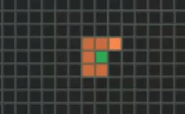
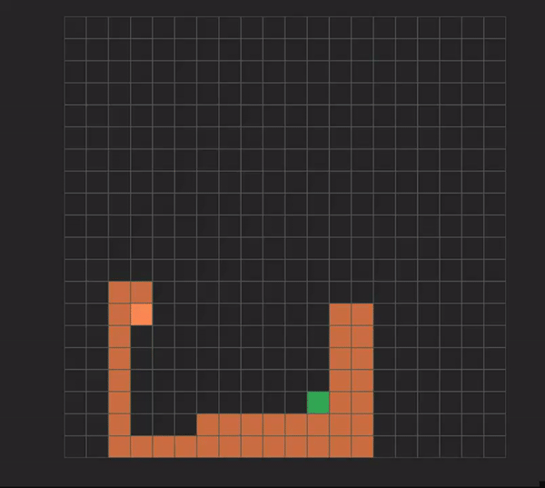
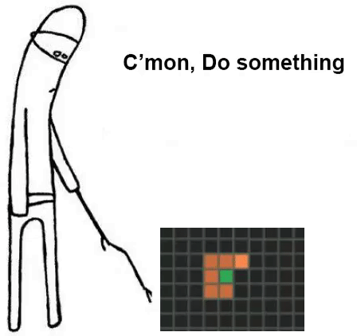

The original idea behind the snake pathing AI was to develop my understanding of cellular automation, a subject I touched on [before](/CellAutomata), while still diving into something new; Originally this led me to looking into pathing algorithms for grid like systems such as Snake, Pacman etc. 

Thinking back to learning about [Dijkstra’s shortest path algorithm](https://en.wikipedia.org/wiki/Dijkstra%27s_algorithm) during my time at University I quickly went down the rabbit hole of researching and came out with the A* Algorithm.This algorithm is incredibly similar to Dijkstra’s, in fact at first glance you’d probably think they’re exactly the same. Except for one significant difference; while Dijkstra looks at all possible paths to a specific node, A* attempts to find which path is the best path by using a ‘heuristic’ function which is a function that ranks paths on their value to decide which one to go down. 

To implement this algorithm, I first had to develop the game snake which I did using the same library used to create my cellular automata, [p5.js](https://p5js.org/); A useful library for manipulating and utilising HTML canvas’ and for building sick renditions of Snake, I mean play it for yourself [here](/examples/snake/index.html).

Once the snake game was built it was time to get down to implementing the AI. I implemented a basic but functional version of A* algorithm, where it would calculate the shortest distance cost to the food and then head down this path. It would do this by first getting the path then translating the path into moves, similar to how a player would move (Up, Left, Right, Down). Once this array of moves was generated it would be given to the snake “AI” and it would proceed. This worked for like -maybe- 6-10 moves but eventually would break, missing out its final move and as such always being one move behind causing it to end up following itself in an endless loop or just straight up ramming itself into a wall. 

In some ways I consider this a success, the snake realised the only way to win was not to score. True AI. 

[[imageout]]
| Snake not scoring. 

To try and compensate for this I added a check for when it is unable to find the food or reach it, it would simply try to survive by targeting the furthest tile it could. This worked to an extent but would still break when entrapping itself from the food. 

[[imageout]]
| Snake entrapping itself.

Not completely sure why but at this point my code had become spaghetti and half my hair had been pulled out, so I have decided to call its quits for *now*. One day I will return to my old pal. 

For now though - you can check out the snake AI in all its glory. I even added snake “thoughts” to the bottom of the screen so you can see when it's bugging out. It's not a bug, it's a ***feature***.

[[button]]
| [Run the pathing AI here](/examples/snake-ai/index.html)

[[imagefull]]
| 