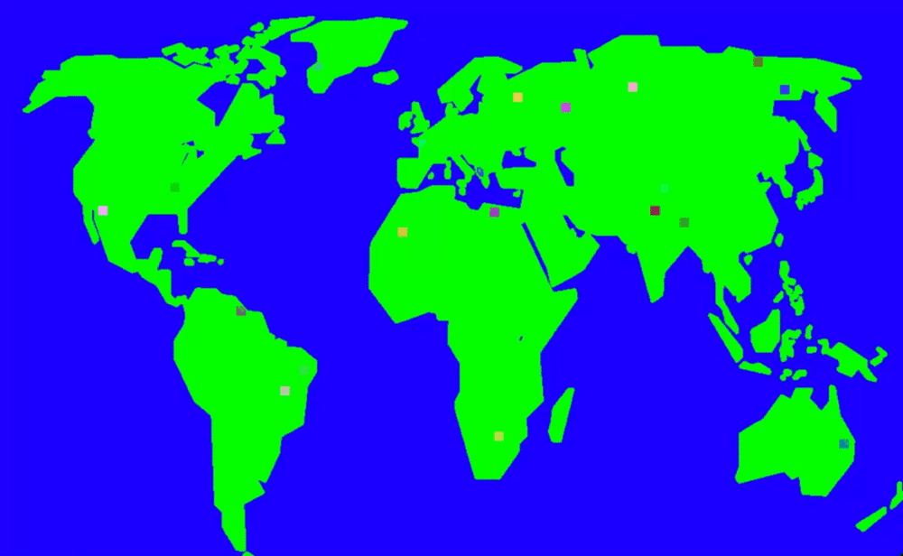
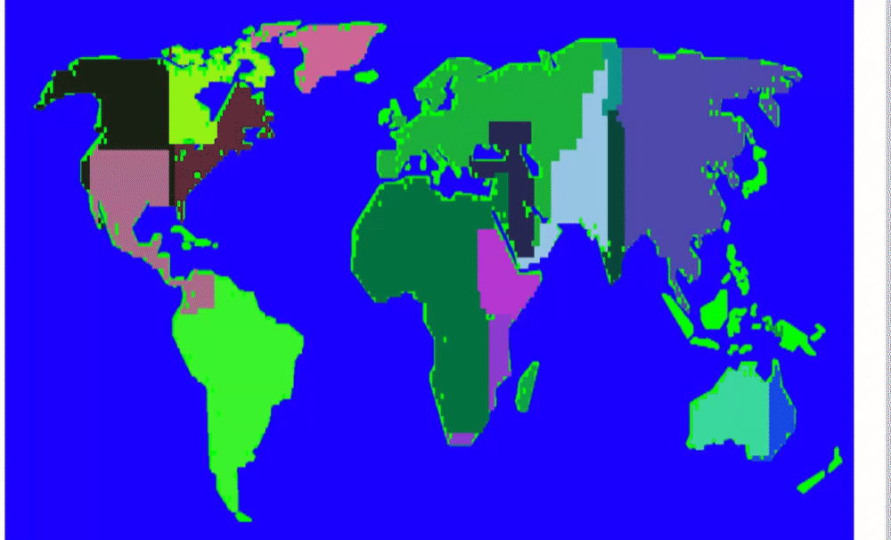
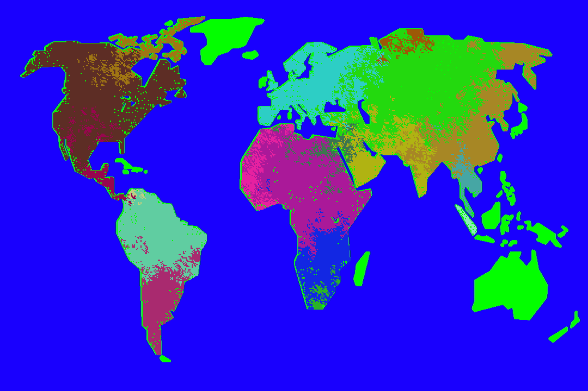

####This post is in ongoing development! Some parts may seem incomplete.

###Cellular automaton is the process of a group of "cells" in a grid which develop through linear time steps.The evolution of these cells are based on rules which are applied in relation to the state of the cells surronding neighbours.

Over the last few weeks I have spent time looking at Cellular Automation, as it looked like a fasinating idea which can both produce beautiful patterns and improve my overall knowledge of the algorithms involved. A popular example of Cellular Automation was [Conway's Game of Life](https://en.wikipedia.org/wiki/Conway%27s_Game_of_Life) also known as just the "Game of Life" due to comparisons on how the cells live and die based on under/over population. I felt this would be a good first step into the realm of the subject so I decided to try and replicate it. The outcome was a successful application built using just Javascript and a library known as [p5.js](https://p5js.org/) which provides functionality for drawing on html canvas'. A convinent iframe displaying my iteration of this can be seen below. 

#####Click "Start" on the examples to run them. 
<iframe class="exampleContainer" src="/examples/conwaysgameoflife/ConwaysGameOfLife.html" width="800" height="600"></iframe>

After developing a working version of Conway's game of life, I decided to try and develop "Wolfram's Elementary Cellular Automaton" dubbed the simplest one-dimensional cellular automation there is; Due to the fact that each cell only looks at two neigbours, its left and right. Despite this definition many cool looking patterns can be made, and as seen in the example below, I have implemented several "rules" defined on [Wolfram maths website](http://mathworld.wolfram.com/ElementaryCellularAutomaton.html). These rules are simply 8 binary digits indicating whether cell is alive or dead. While I suggest you read up on the rules via the wolfram site link provided, the result is as seen below. 

#####You can switch the rule using the dropdown at the top of the example.
<iframe class="exampleContainer" src="/examples/wolframs/Wolframs.html" width="800" height="600"></iframe>

Next I decided to try something a bit more challenging, develop my own cellular automata, inspired by the YouTuber [Hopson](https://www.youtube.com/watch?v=t73z0fzxMlE&t) I wanted to create an empires cellular automata, where teams of cells compete to be the last team standing on a world map. This would involve my own set of rules for each cell. First I had to actually get the cells to populate the map, so I set up an array for every single cell on the map along with an array with every single land cell on the map (By scanning the image for cells with the colour Green). Then I used both these arrays to set it so when a cell is next to a empty land tile, it will populate it with a cell of its own team. Once a bunch of cells from one team bumped into another team they came to a standstill, which is exactly what I wanted, because it means it recognised that the enemy cells were not empty pieces of land, as seen below.

[[imageout]]
| Gif of the teams in action

Next I had to add combat, and this took the longest time, not because the difficulty of the code but more because I had no idea how to create a balanced combat system where one team couldn't just conquer the entire map as soon as they had got going, first I tried to get them to fight on an equal playing field..

[[imageout]]
|The first attempt didn't fair so well...

This ended up looking more like a animated Piet Mondrian art piece than an empires automation, and something didn't feel right, it was as if all the cells had the same health... which they did. I accidently had set the new "child" cells health as a direct pointer to the parents health, rather than creating a new one. Not only that but it felt like I needed to give more chance in whether they win or lose, more than just "if health is bigger, kill" and as such I added a random number from 1 - 6 which would add to the cells health divided 100 (Cells health would go up in 100s), this lead to the teams living in harmony

[[imageout]]
| You guys are meant to fight.. not this

What was going wrong this time? Well for starters instead of replacing the enemy cells upon winning a battle, i was lazily reusing a "kill" function from earlier in development, which replacland with empty land, allowing either team to refill it. This wasn't the only issue, it seemed as if neither team could ever win due to the balance of the dice system. So I decided I needed a few more elements, first was "Age" where each frame every cell would increase in age by one, if their age reached about 50, they rolled a dice of their age, if it landed above 50, they died. I didn't want this to be an absolute as it caused a mexican wave of deaths, with cells of 50 all dying at the same time (did not seem very natural). Further I made the fighting a bit more one sided, as well as the dice and their health, the overall cell count of the team would be taken into account, divided by 100,000 (It just works..) I had to also increase the dice to around 10000 for good measure, and the end result can be seen in the lovely example below.

[[imagefull]]
| The end result.

[[button]]
| [View the final version here](/examples/empires/empires.html)
