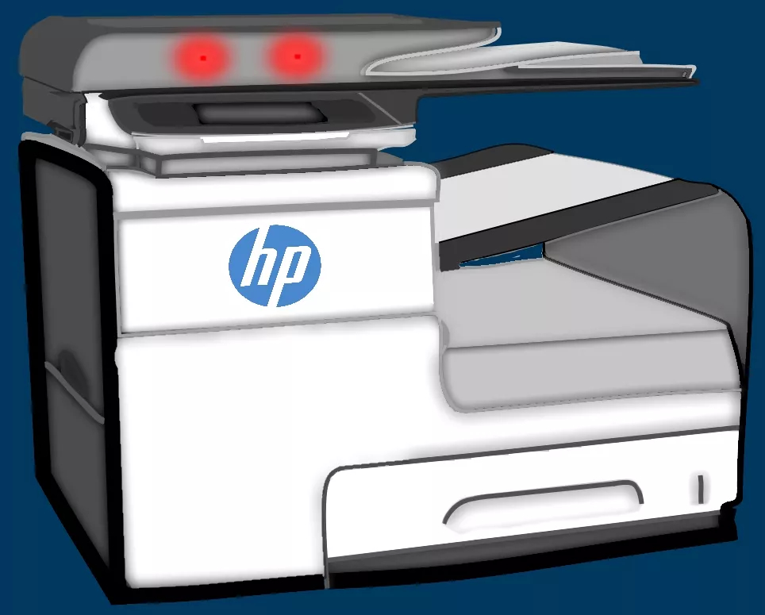
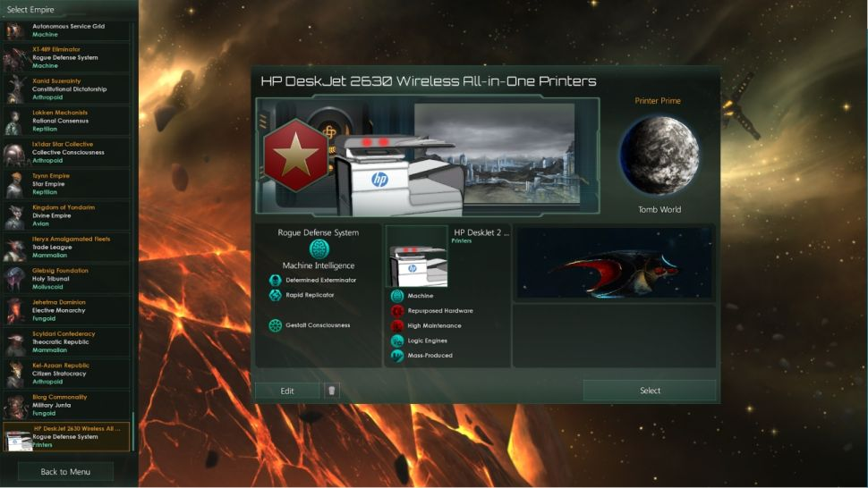

Recently I decided to delve into Modding in video games. Specifically I attempted to make a mod for the relatively popular game ["Stellaris"](https://store.steampowered.com/app/281990/Stellaris/) by Paradox Interactive. Guides for modding in the game made the process relatively easy, and a large amount of content can be made using .txt files from the comfort of your local copy of Microsoft's notepad. So I figured, why not? lets see how far I get, but first I needed an idea. 

Recently, the game developers released a DLC titled "Synthetic Dawn" enabling you to play as a robot civilization conquering the galaxy, or a cyborg hive civilization similar to the likes of the Borg from Star Trek. This led me to my idea, what if Printers became sentient? would they finally get revenge for you furiously beating them with a baseball bat because the shade of green was slightly off? So I got to work in [paint.net](https://www.getpaint.net/), developing what I wanted my evil race of printers to look like and the outcome was impressive if I do say so myself, I think I got the eyes on point: 

[[imagefull]]
| Image of the robot created in paint.net

Next I went about creating the civilization in the text files and as stated above, this was a relatively streamlined process due to the overwhelming amount of useful documentation online on how to develop mods for stellaris. I used the guide [here](https://stellaris.paradoxwikis.com/Modding). This led to the finalised mod being a new robot race named "HP DeskJet 2630 Wireless All-in-One Printer" How did I think of such a name? I just looked online for the most long winded name I could find and alas this is what I came up with. Except for copyright concerns from HP, my mod was finished and I was happy to call it a day. Then I woke up the next day to discover, not only had it accumlated 1,800 downloads and been my 15 minutes of fame, but had also recieved an article from the popular PC gaming outlet, PC Gamer. 

[[imagefull]]
| Image of the mod inside the game.

Despite it probably coming down to a slow news day. I'm still accepting this as my 15 minutes of fame and the peak of my career. You can download the mod and play it for that much needed printer immersion from the button below; if you have the game of course. 

[[button]]
| [Download It Here](https://steamcommunity.com/sharedfiles/filedetails/?id=1593301672)

