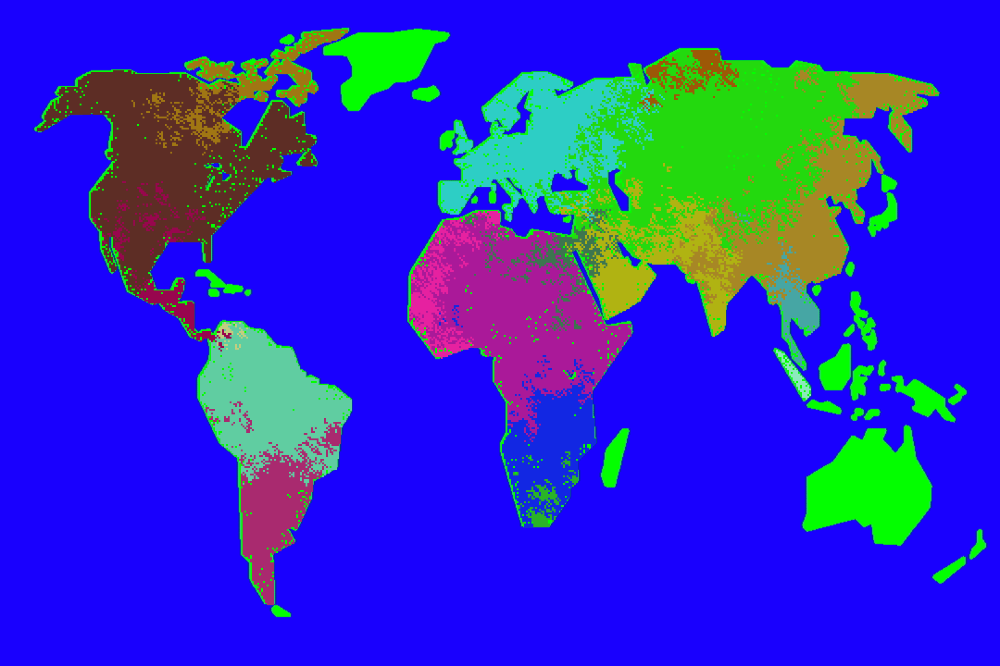

###The "Empires" game is a cellular automata where a specified amount of teams spawn on a canvas containing an image of the world. The goal is for one team to conquer the other teams of their continent to become the last empire standing. 

<!--&nbsp;-->

Building this was a fun challenge, using my knowledge from previously done work during unviersity on the subject of cellular automation, which I discuss in detail [here](/CellAutomata)

The game is built using the JavaScript library [p5.js](https://github.com/processing/p5.js/wiki/p5.js-overview), which is a library based on the popular Java library Processing by the same creators. The main reason for using this library was that it gave greater interactivity with HTML canvas'. 

[[imagefull]]
| The end result.

[[button]]
| [View it here](/examples/empires/empires.html)
