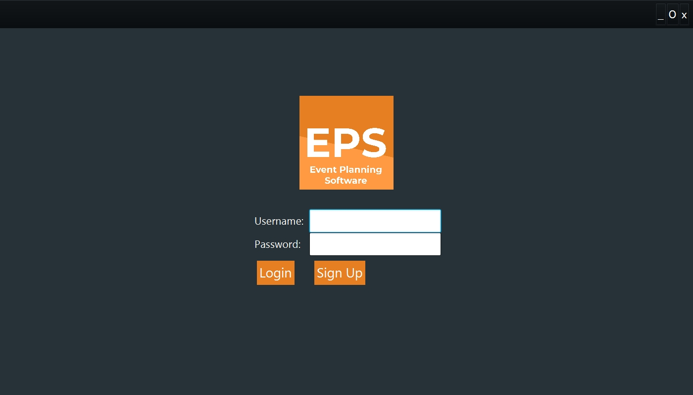

###My overall dissertation project achieved a grade of 85%, above the First-Class threshold of 70%, this includes the accompanying 10,000 words dissertation essay, as well as a presentation VIVA.

<!--&nbsp;-->

Throughout my third year at University I planned and built the application for my final year project (Dissertation). The application was primarily developed in Java, with the JavaFX library being used to create the GUI and the Java Database Connectivity (JDBC) library being used to manage the SQL connection to the database. The open source  [JFoenix java library](https://github.com/jfoenixadmin/JFoenix)  was also used for some of the user interface elements, which uses JavaFX components to implement Google Material Design.

[[image]]
| Screenshot of the login screen

MySQL using MySQL Workstation and MariaDB were also used to create and maintain the database. This was hosted on a remote server at De Montfort University.

[[title]]
| 

#####In summary, what I built was:

-   Full login system. New users can create accounts and then immediately access them by entering their login details.
-   Event creation, editing and deletion. Event information including a title, description, date of event, as well as the guest list used.
-   Guest list creation, editing and deletion. Guest lists could be created, containing guests which have a name and email address. Once a guest list is added to an event any guests on the list which have an account on the application corresponding to the guest's email address will be invited to the event and can browse the event details by logging into their own account.
-   Administrator System. Accounts can be made into "Administrators" which allows them to have extra privileges. This includes the ability to delete and edit other account details, as well as create and edit “Event Types”. Event Types were a late stage feature added to inspire users with various basic event type ideas, which they could click on to open Event templates, helping ease the time it takes to create events of similar nature.